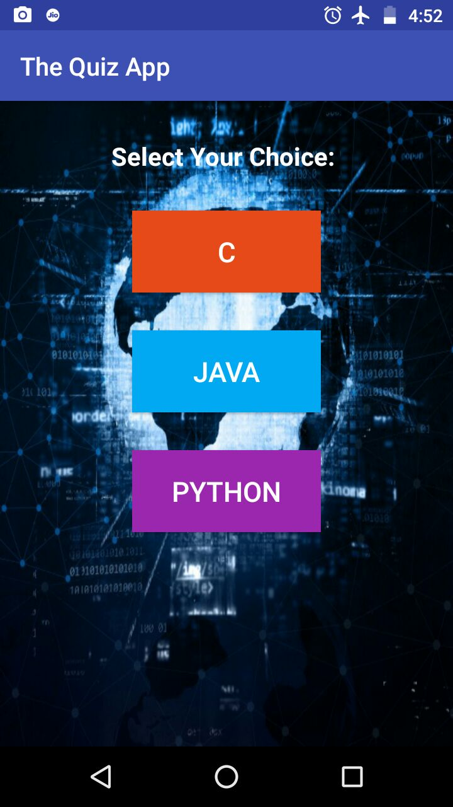
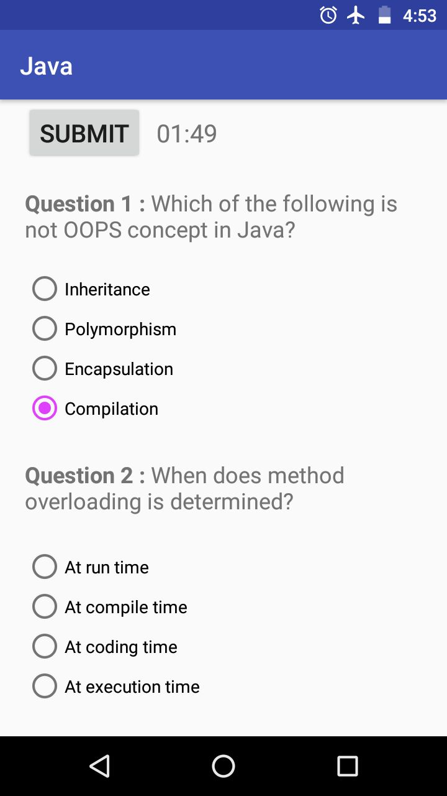
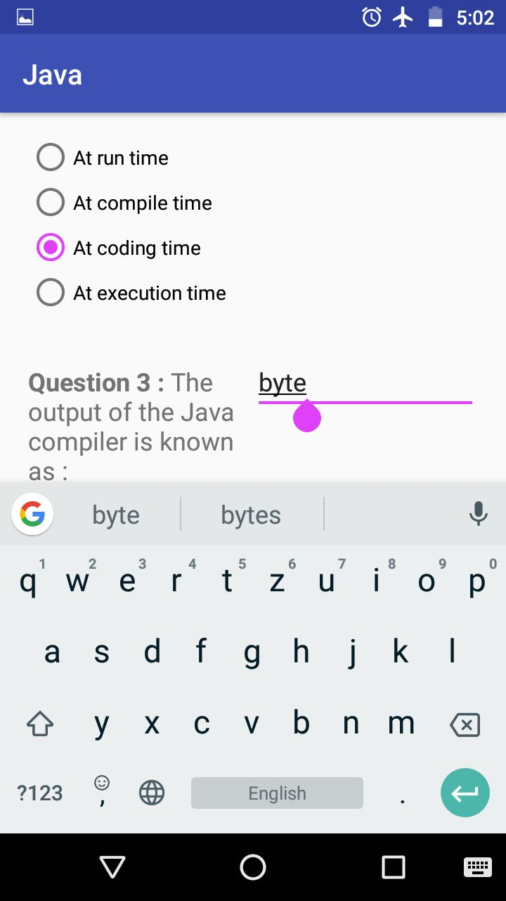
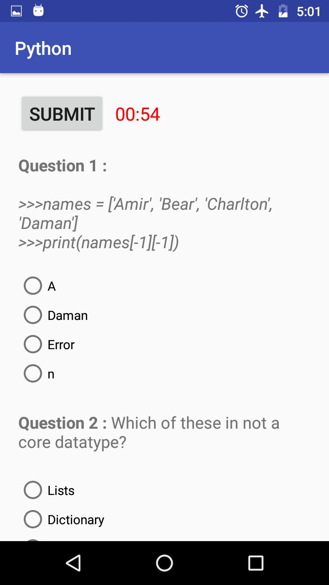
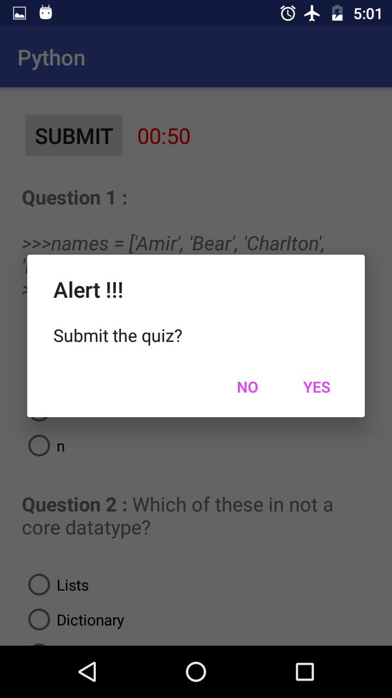
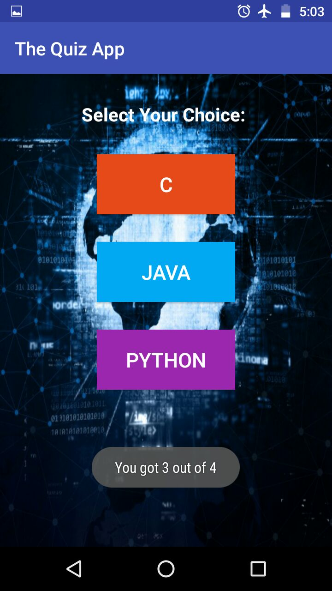

# TheQuizApp for Udacity
* This app is created under Udacity's Google India Challenge Scholarship Program for Android Basic Course.
* https://in.udacity.com

# ScreenShots

   
  

#### See [`LICENSE`](https://github.com/ahadali/TheQuizApp/blob/master/LICENSE). 
